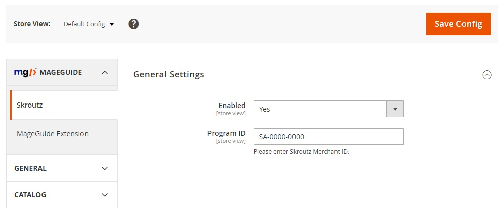

# MageGuide Skroutz Analytics
[Deprecated]

Adds **Skroutz S.A.** tracking code to your Magento 2 e-shop  
Tested on Magento 2.2+

## Functionalities 

* This module is responsible for collecting the required data when a new order is placed and sending them over to Skroutz Merchant Platform.
* Provides helpful & simplified integration for store owners to send the order information to Skroutz Merchant Platform.
* Follows all the required development guidelines from Skroutz S.A.
* Available only for the Greek comparison shopping engine (Skroutz.gr)

## Usage 

1. Copy the module files inside your app/code folder  
2. Enable the module with the following commands from your Magento root:  
```php bin/magento module:enable MageGuide_Skroutz```  
```php bin/magento setup:upgrade```  
3. Activate the module (Store > Configuration > MAGEGUIDE > Skroutz Analytics > General Settings > Enabled)  
4. Configure your Skroutz Merchant ID (Store > Configuration > MAGEGUIDE > Skroutz Analytics > General Settings > Program ID)  

## Customization

This module works out of the box with the default Magento checkout and many other checkout modules that use the default order success page (e.g. Amasty Checkout).  
If you have installed and use a third party checkout module, then you need to apply the following changes:  

1. copy the module's checkout success layout file (app/code/MageGuide/Skroutz/view/frontend/layout/checkout_onepage_success.xml) to your theme's appropriate layout folder (your_theme/MageGuide_Skroutz/layout)
2. rename the new file with the appropriate layout update (e.g. "uxcheckout_index_success" for UXCheckout)
3. don't change the file's extension (.xml)

## Screenshots



## Feedback / Todo

1. Fix tax rate to adjust dynamically (it is default 1.24 now)
2. Add configuration option for preferred product identifier (sku or id)